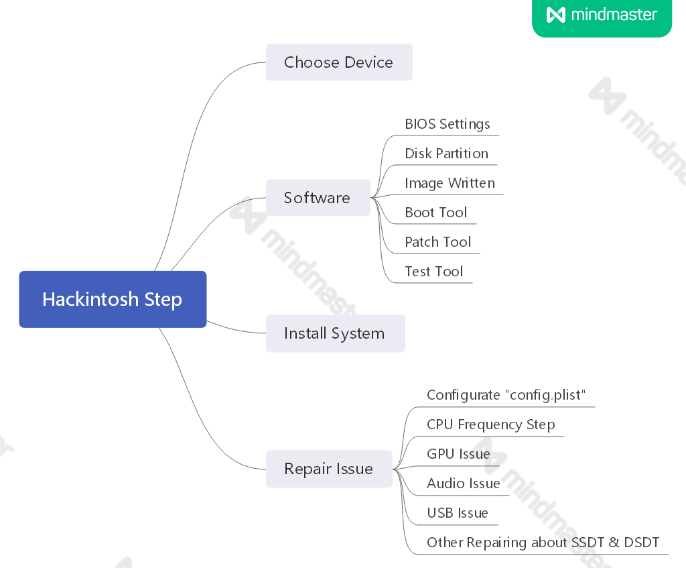
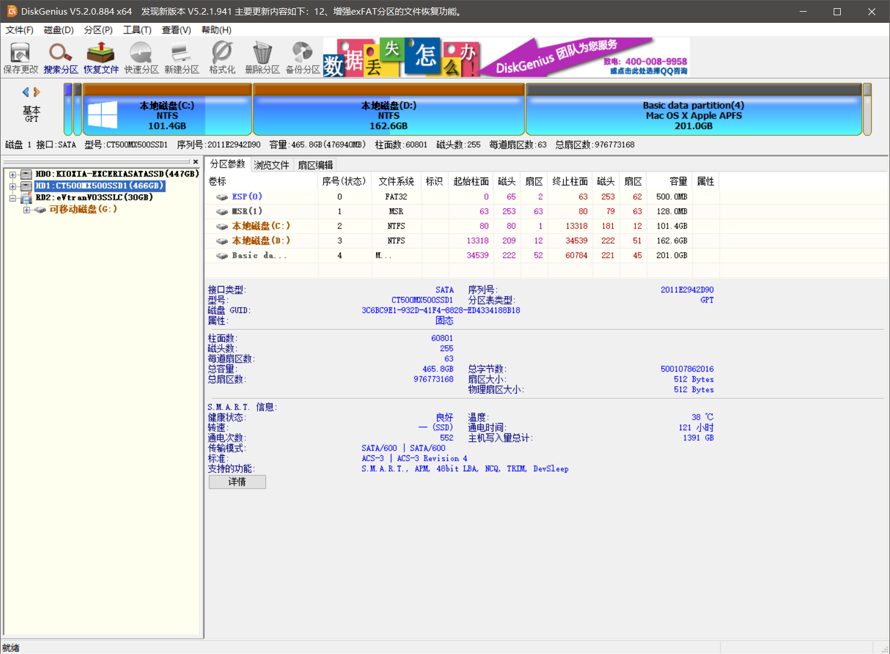
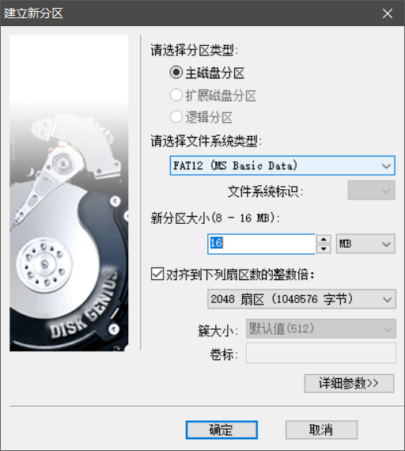
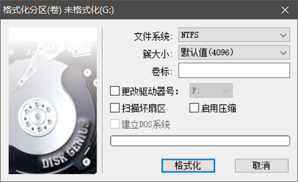

## **Guidence**
***
```This guidence will tell you how to make a perfective hackintosh device```
## **Contents**
* [Before Start](#BeforeStart)
* [References](#References)
* [Choose Device](#Choose-Device)
  * [Desktop PC](#Desktop-PC)
    * [CPU](#CPU)
    * [GPU](#GPU)
    * [Motherboard](#Motherboard)
    * [Stroage](#Storage)
    * [Memory](#Memory)
    * [WLAN Card & Bluetooth](#WLAN-Card(&Bluetooth))
    * [Barebone Computer](#BareboneComputer)
  * [Laptop](#Laptop)
    * [CPU](#Mobile-CPU)
    * [GPU](#Mobile-GPU)
    * [Motherboard](#Mobile-Motherboard)
    * [Mobile Storage](#Mobile-Storage)
    * [Laptop Memory](#Laptop-Memory)
    * [Laptop WLAN Card & Bluetooth](#Laptop-WLAN-Card(&Bluetooth))
* [BIOS Settings](#BIOS-Settings)
  * [Enable](#Enable)
  * [Disable](#Disable)
* [Disk Partition](#Disk-Partition)

## **BeforeStart**
```diff
!   1. Be Patient
!   2. Studious and come up with a solution via all ways you can find(Search Engine,BBS,YouTube etc.)
- When you lose a patient:
+   1.Buy a Mac
+   2.Go to reddit and pay some money
```
## References
* ```tutorial```
  1. [**tonymacx86**](https://www.tonymacx86.com/)
  2. [**reddit**](https://www.reddit.com/r/hackintosh/)
  3. [**youtube**](https://www.youtube.com)
* ```Hackintosh Step```
---
  * 
---
## **Choose-Device**
```A good device choice is half the battle```
### __Desktop-PC__
#### CPU
```diff
Recommand
+    1.Intel 9th generation Core i3/i5/i7/i9 series(Coffee Lake)
+    2.Intel 8th generation Core i3/i5/i7 series(Coffee Lake)
+    3.Intel 4th generation Core i3/i5/i7 series & Intel Xeon E3-12XXV3 series(Hasewell)
+    4.Intel 3rd generation Core i3/i5/i7 series & Intel Xeon E3-12XXV2 series(Ivy Bridge)
Can Support
!   1.Intel Pentium G Series(such as G2030 G3260)
!   2.Intel Core E series(such as E8400 E5800) & Intel Core Q series(such as Q9600)
!   3.Intel Celeron G Series(such as G1840)
!   4.Intel 10th generation Core i3/i5/i7/i9 series(Comet Lake)(only support OC boot)
!   5.AMD Ryzen 1st/2nd/3rd series
!   6.AMD A Series APU(such as A10-7800 A10-9600)
Don't
-   1.Intel Atom Series(such as D525 N330)
-   2.AMD Ryzen APU(such as 2200G 3400G)
-   3.Intel Celeron N Series(such as N1900) & J Series(such as J4100)
#   CPU which not mentioned above please search by yourself
```
#### GPU
  1. Brand
     ```diff
     Recommand
     +  1.Sapphire
     +  2.Dataland
     +  3.Asus
     Can Support
     !  1.AsRock
     Don't
     -  1.XFX
     -  2.Reference
     ```
  2. Model
     ```diff
     Recommand
     +  1.Radeon RX5500XT/RX5600XT/RX5700
     +  2.Radeon RX560XT/RX590
     +  3.Nvidia GPU Card with Kepler architect(such as GTX760 GTX690)
     +  4.Intel HD/UHD series desktop GPU(integrated,exclude 10th generation)
     Can Support
     !  1.Nvidia GPU Card with Maxwell architect(such as GTX970 GTX1060)(need WebDrive and OS version up to 10.13.6)
     !  2.Radeon RX5700XT(may need black screen patch)
     !  3.Radeon RX460/RX470/RX480/RX560/RX570/RX580(2304SP)(miner card)
     Don't
     -  1.Radeon RX580 2048SP(device-id isn't 1002-67DF)
     -  2.Nvidia GTX16 series and RTX20 series
     #  GPU which not mentioned above please search by yourself
     ```
#### Motherboard
  1. Brand
     ```diff
     Recommand
     +  1.Gigabyte
     +  2.Asus
     +  3.AsRock
     +  4.MSI
     Can Support
     !  1.Onda
     !  2.Colorful
     Don't
     -  1.Soyo
     -  2.OEM
     ```
  2. Chipset
     ```diff
     Recommand
     +  1.Z390 Chipset
     +  2.Z370 Chipset
     +  3.B85 Chipset
     Can support
     !  1.B360 Chipset
     !  2.H310 Chipset
     !  3.B75 Chipset
     !  4.B450 Chipset
     !  5.H310 Chipset
     Don't
     -  Old Chipset(such as Intel 965 AMD A55)
     #  Chipset which not mentioned above please search by yourself
     ```
#### Storage
```diff
Recommand
+   1.Samsung 970 EVO(NVME)
+   2.Western Data SN730(NVME)
+   3.KIOXIA RC10(NVME)
+   4.Micron MX500(SATA)
+   5.Samsung 860 EVO(SATA)
+   6.KIOXIA TC10(SATA)
Don't
-   1.Samsung 970 EVO Plus(NVME)
-   2.Samsung PM981/PM981A(NVME)
-   3.Intel Optane Series(NVME)
-   4.Intel 660P QLC(NVME)
```
#### Memory
```diff
Recommand
+   1.KingSton
+   2.Micron
+   3.KLEVV
Don't
-   1.Samsung
-   2.Corsair
-   3.non-brand(such as Cuso)
```
#### WLAN-Card(&Bluetooth)
```diff
Recommand
+   1.Boardcom 943602CS (2.4G/450Mbps 5G/1300Mbps Bluetooth 4.2)
+   2.Boardcom 94360CD  (Fenvi T919) (2.4G/450Mbps 5G/1300Mbps Bluetooth 4.0)
+   3.Boardcom 94360CS2 (2.4G/450Mbps 5G/867Mbps Bluetooth 4.0)
Can Support
!   1.Boardcom 94350ZAE (DW1820A)(2.4G/300Mbps 5G/867Mbps Bluetooth 4.1)
Don't
-   1.Intel AX series(such as AX200)
-   2.Intel AC series(such as 9260ac 3160ac)
#  WLAN Card which not mentioned above please search by yourself
```
#### BareboneComputer
```diff
+   1.Intel NUC8 Series
+   2.AsRock Deskmini310 Series
```
### __Laptop__
  * [LTS Laptop List](https://blog.daliansky.net/Hackintosh-long-term-maintenance-model-checklist.html)
#### Mobile-CPU
```diff
+   Intel Core i3/i5/i7 mobile series
-   Intel Atom mobile series(such as N270)
-   AMD Ryzen 4 series mobile CPU(such as 4600U)
#   CPU which not mentioned above please search by yourself
```
#### Mobile-GPU
```diff
-   Nearly all AMD or Nvidia mobile GPU are not supported
-   Intel 10th generation(Ice Lake) mobile GPU haven't supported yet
+   Intel GMA/HD/UHD series mobile GPU(integrated)
+   Nvidia Geforce GT320m(individual)
+   Nvidia Geforce 9400m(individual)
#   GPU which not mentioned above please search by yourself
```
#### Mobile-Motherboard
* ``` Depends on your CPU ```
#### Mobile-Storage
* [Desktop PC Storage)](#Storage)
#### Laptop-Memory
```diff
-   some LPDDR4X model memorys may cause crash
```
#### Laptop-WLAN-Card(&Bluetooth)
* [Desktop PC WLAN-Card(&Bluetooth)](#WLAN-Card(&Bluetooth))
## BIOS-Settings
### Enable
```diff
!   some motherboard may not contain these options,if your installation are normal,you can ignore that,or you need patch them 
+   1.VT-x
+   2.Exective Disable bit
+   3.iGPU(only use iGPU or multi-monitor) / IGFX
+   4.Above 4G decoding
+   5.XHCI-Handoff
```
### Disable
```diff
-   1.Fast Boot
-   2.CSM
-   3.CFG Lock
-   4.Secure-Boot
-   5.VT-d
-   6.Boot Option -- OS Type -- Other
-   7.Onboard Wi-Fi and Bluetooth
```
## **Disk-Partition**
```diff
!   We assume that you have a new computer.
!   If you already have a computer with windows operating system,PLEASE BACKUP YOUR DATA
```
### __Create-ESP(EFI)-volume__
```diff
!     Usually,windows operating system disturbute about 120MB for ESP(EFI) volume
      1.Download 'DaBaiCai Installation Tool'
```
*   [DaBaiCai Installation Tool](https://pan.baidu.com/s/1HTCgWwzTIrK9V_VYv7olWw)  
    **Code: 0iob**
```
      2.Open it and download all components,press OK(确定)
      3.Wait for download(may take 5 minutes)
```

```diff
!     Before the next step,YOU MUST BACKUP YOUR DATA
      4.connect your USB flash disk,and press 'One-Key-Make-USB-Boot-Device'(一键制作成USB启动盘)
      5.Wait for making
      6.Reboot and enter WinPE system
      7.Open 'Diskgenius.exe'
      8.Choose the disk you want to install MacOS and Windows
```

```
      9.Partition(分区) --- create ESP(EFI)/MSR partition(建立ESP/MSR分区)
```

```diff
!     You can change the size from 350MB to 500MB as you like
      10.Change ESP(EFI) volume size
```

```
      11.Press 'OK'
```
### __Volume-Division__
```diff
+     You can partition your disk into 3 volumes(assume your disk size is 500GB,465GB avaliable)
+     Windows:  2 volumes  (C(120GB) and  D(144GB))
+     MacOS:  1 volume(MacOS(200GB))
```
* ```Windows Partition``` 
```
      1.Partition(分区) --- create new partition
```

```diff
      2.File system(文件系统类型) --- NTFS
      3.Input the size you want
      4.Press 'Ok'
      5.Press F8(Save partition table)(保存分区表)
      6.Partition --- format current partition(格式化当前分区)
+     Recommand cluster size is 4096 bytes
      7.Press 'Format'
```
  
* ```MacOS partition```
```diff
-     Don't format volume
+     Use MacOS --- 'Disk Tool' instead
```
### __Windows-Installation__
```diff
!     You need another available PC to write image
-     Don't use DaBaiCai Tool(大白菜) install Windows
```
  * ```Download Windows image```  
      * [Windows 10 Consumer X64] (ed2k://|file|cn_windows_10_consumer_editions_version_1909_updated_jan_2020_x64_dvd_47161f17.iso|5417457664|274FEBA5BF0C874C291674182FA9C851|/)(```memory size above 4GB```)
      * [Windows 10 Consumer X86] (ed2k://|file|cn_windows_10_consumer_editions_version_1909_updated_jan_2020_x86_dvd_9c50652f.iso|3884539904|0F2E887F2845BCD5C61E99E74D717287|/)(```memory size less than 4GB```)
  * ```Download UltraISO```
      * [UltraISO 9.72](https://pan.baidu.com/s/1BYKaktRlW_fiEIVJ4Tju8w)  
        **Code: en9v**  
  * ```Loading image```  
  ```  
        1. Open 'UltraISO.exe' by administator mode
        2. Press F6(load to virtual DVD-ROM)
        3. Choose image file
        4. Press load(加载)
  ```  

  ```
        5.Choose start(启动)
        6.Write harddisk image(写入硬盘映像)
  ```

  ```diff
  !     You MUST BACKUP your data BEFORE the next step,your flash disk WILL BE FORMATTED
        7.Choose write(写入)
        8.Restart Computer and wait for boot
        9.Follow Windows Installation Guide and finish it
  ```
* ```Now your computer are running Windows 10```
## __MacOS Installation__


